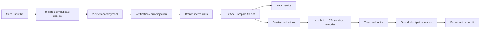

# Convolutional Encoder & Viterbi Decoder

SystemVerilog implementation of an 8-state convolutional encoder and Viterbi decoder, including branch-metric computation, add-compare-select logic, survivor-path storage, traceback, and verification testbenches.

The design was developed and simulated in an EDA Playground workflow using Siemens Questa and synthesized with Precision Synthesis. The project was developed in the context of FPGA/digital-communications coursework using the Digilent Basys 3 / Xilinx Artix-7 platform.

## Highlights

- 8-state convolutional encoder
- 1-bit serial input to 2-bit encoded symbol
- Hamming-distance branch metrics
- Eight add-compare-select (ACS) units
- Accumulated path metrics and survivor-path selection
- Four 1024-word survivor-memory banks
- Dual traceback units
- Buffered decoded-output reconstruction
- End-to-end encoder/decoder verification
- Deterministic symbol corruption for error-correction testing
- Randomized input sequences in the testbench

## Architecture



The encoder maintains a 3-bit state, giving eight possible trellis states. Each input bit selects one of two state transitions and produces a 2-bit encoded symbol.

The decoder compares each received 2-bit symbol against the expected symbols for the possible trellis transitions. Branch metrics are combined with accumulated path metrics, and an ACS stage selects the lower-cost survivor path for each destination state. Survivor decisions are stored in memory and later traversed by the traceback units to reconstruct the most likely transmitted bitstream.

More detail is available in [`docs/architecture.md`](docs/architecture.md).

## Repository Structure

```text
viterbi-encoder-decoder/
├── README.md
├── rtl/
│   ├── design.sv
│   ├── encoder.sv
│   ├── decoder.sv
│   ├── viterbi_tx_rx_2a1.sv
│   ├── ACS.sv
│   ├── tbu.sv
│   ├── mem_8x1024.sv
│   ├── mem_1x1024.sv
│   └── bmc000.sv ... bmc111.sv
├── testbench/
│   ├── primary/
│   │   ├── viterbi_tx_rx_tb.sv
│   │   └── encoder_tb.sv
│   └── alternate/
│       └── testbench.sv
└── docs/
    ├── architecture.md
    ├── verification.md
    └── eda-playground.md
```

## RTL Modules

### `encoder.sv`

Implements the convolutional encoder as an 8-state finite-state machine. A serial input bit determines the next trellis state and corresponding 2-bit encoded output.

### `decoder.sv`

Top-level Viterbi decoder. It coordinates:

- branch-metric computation
- path-metric accumulation
- survivor-path selection
- survivor-memory banking
- traceback
- decoded-output buffering

### `bmc000.sv` ... `bmc111.sv`

Eight branch-metric computation modules. Each computes the Hamming-distance cost associated with the two incoming trellis paths for one destination state.

### `ACS.sv`

Add-Compare-Select unit. It adds branch metrics to incoming path metrics, handles path validity, and selects the lower-cost survivor.

### `tbu.sv`

Traceback unit. It traverses stored survivor decisions and reconstructs the decoded bit sequence.

### `mem_8x1024.sv`

1024-entry, 8-bit survivor-decision memory.

### `mem_1x1024.sv`

1024-entry, 1-bit decoded-output memory.

### `viterbi_tx_rx_2a1.sv`

End-to-end encoder/decoder wrapper used for verification. It also contains controlled encoded-symbol corruption so decoder behavior can be tested under transmission errors.

### `design.sv`

Convenience include file for loading the RTL modules in EDA Playground.

## Verification

The primary end-to-end testbench stores both the original input stream and the decoded output stream, aligns them after decoder latency, and compares the recovered bits against the transmitted bits.

The verification wrapper deliberately flips both bits of two consecutive encoded symbols at selected word positions, while the testbench also exercises deterministic and randomized input sequences.

See [`docs/verification.md`](docs/verification.md) for details.

## EDA Playground

The source layout originated from an EDA Playground workflow.

For a similar setup:

- Language: SystemVerilog
- Simulator: Siemens Questa
- Design source: contents of `rtl/`
- Testbench: select one top-level testbench from `testbench/`
- Do **not** compile both end-to-end testbench variants simultaneously because they use the same module name.

See [`docs/eda-playground.md`](docs/eda-playground.md).

## Tools / Technologies

- SystemVerilog
- RTL design
- Digital communications
- Viterbi decoding
- Siemens Questa
- Precision Synthesis
- EDA Playground
- FPGA synthesis
- Digilent Basys 3 / Xilinx Artix-7

## Notes

The repository contains the authored RTL and verification source. Generated vendor netlists are intentionally not included.
