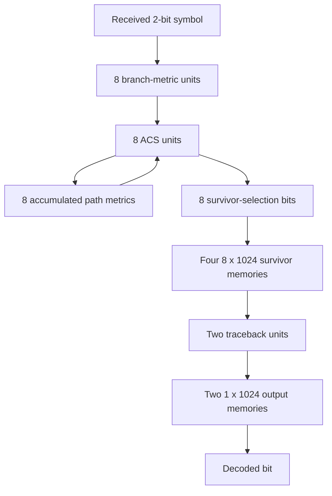

# Architecture

## Encoder

The encoder is an 8-state finite-state machine represented by a 3-bit state register. For each serial input bit:

1. the current trellis state is read;
2. one of two transitions is selected;
3. the next 3-bit state is generated;
4. a 2-bit encoded symbol is emitted.

This gives a rate-1/2 convolutional encoder: one source bit produces two encoded bits.

## Decoder Data Path

The Viterbi decoder is organized around the standard branch-metric / path-metric / survivor-path flow.

## Branch Metrics

Each `bmcXYZ` module evaluates the two possible incoming branches for one destination trellis state. The two-bit branch metric represents the Hamming distance between the received encoded pair and the encoded pair expected for that transition.

## Add-Compare-Select

Eight `ACS` instances operate in parallel, one for each destination state.

For each destination state, the ACS stage:

1. adds each incoming branch metric to its predecessor path metric;
2. checks whether each predecessor path is valid;
3. compares the two candidate costs;
4. selects the lower-cost candidate;
5. outputs the new path metric and survivor-selection bit.

The decoder maintains eight 8-bit accumulated path metrics.

## Survivor Memory

The eight survivor decisions produced each cycle are written as an 8-bit word into one of four 1024-entry memory banks.

The design rotates between the four memory banks while separate banks are read in reverse address order for traceback.

## Traceback

Two traceback units operate on survivor-memory outputs. Each traceback unit tracks a 3-bit trellis state and uses survivor decisions to move backward through the stored trellis.

Decoded bits are written into two one-bit output memories, which are then read in forward order to produce the recovered serial output stream.

## End-to-End Wrapper

`viterbi_tx_rx_2a1.sv` instantiates both the encoder and decoder. It is primarily a verification wrapper and includes controlled error injection between the two blocks.

The wrapper flips both bits of two consecutive encoded symbols at selected word positions, allowing the decoder's correction behavior to be observed without an external channel model.
